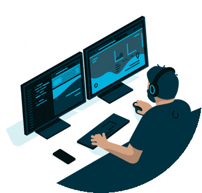

<h2> Hi, I'm Kyle </h2>

<p>SOAR Engineer at <a href="https://sekuro.io/">Sekuro.io</a></br>SOAR Engineer at <a href="https://www.macquarie.com.au/">Macquarie Bank</a></p>

[](https://www.linkedin.com/in/kyle-lamont-m3/)
[](https://github.com/Zero2164)

###  More about me...  

```Javascript
const kyle = {
  focus:
    "Building secure, automated systems that simplify team workloads.",

  code: ["JavaScript", "TypeScript", "Python", "Go", "HTML", "CSS"]

  tools: [
    "Swimlane / Turbine SDKs",
    "Node.js",
    "LitHtml",
    "React",
    "Ansible",
    "Docker",
    "Kubernetes",
    "GitLab CI/CD",
    "Bash/ZSH"
    "Powershell"
  ],

  strengths: [
    "SOAR engineering",
    "Workflow Orchestration",
    "Solutions Architecture",
    "API integrations",
    "Secure-by-default design",
    "Frontend development"
  ],

  projects: {
    current: "Vyra - K8s - Go + TypeScript automation solution",
    personal: [
      "Knucklebones Adaptaptation - Local 2-player dice web game"
    ]
  },

  challenge:
    "Crafting an automation solution that will shake the cyber industry."
};

```
<br>
<p>I’m all about building the <em><b>right tools</b></em> and the <em><b>right relationships</b></em>. If you’d like to connect, I’m always up for a conversation.</p>

</div>
